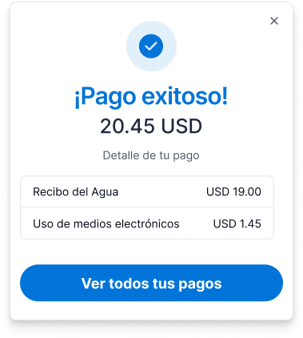
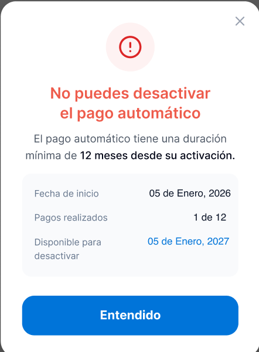

# Prompt para Claude Code — Ajustar el tamaño/encuadre de las imágenes en habitanto.html

Copia y pega esto en Claude Code (dentro de esta carpeta). El problema no es solo que algunas capturas tengan chrome de Figma horneado — es que las imágenes en `assets/habitanto/` tienen proporciones muy distintas entre sí, y el CSS actual de `.shot` no las normaliza, así que los "mockups de teléfono" salen de alturas y proporciones inconsistentes en la misma fila o grid.

## El diagnóstico exacto

Corre esto para confirmar (ya lo corrí yo, pero verifícalo):

```bash
cd assets/habitanto && python3 -c "
from PIL import Image
import os
for f in sorted(os.listdir('.')):
    if f.endswith('.png'):
        im = Image.open(f)
        w,h = im.size
        print(f'{f:45s} {w:5d}x{h:<5d} ratio={round(w/h,3)}')
"
```

Resultado actual (ancho/alto — un iPhone real da ~0.46):

```
admin-contactos.png                             334x700   ratio=0.477
admin-detalle-unidad.png                        408x920   ratio=0.443
admin-home-mora.png                             312x740   ratio=0.422
admin-listado-mora.png                          506x752   ratio=0.673
admin-mensaje-bilingue.png                      411x514   ratio=0.8
admin-registro-pago.png                         426x1020  ratio=0.418
admin-reportes-cxc.png                          410x920   ratio=0.446
admin-reportes-pagos.png                        422x920   ratio=0.459
admin-reservas-confirmar.png                   1372x876   ratio=1.566
proceso-flujo-escenario1.png                   1568x447   ratio=3.508
proceso-flujo-escenario2.png                   1568x498   ratio=3.149
residente-activo-confirmacion.png               398x624   ratio=0.638
residente-banners-intento1.png                  388x872   ratio=0.445
residente-comunidad-detalle.png                 392x830   ratio=0.472
residente-comunidad-feed.png                    394x843   ratio=0.467
residente-configuracion-pagos.png               512x1106  ratio=0.463
residente-cuentas-pendientes.png                356x812   ratio=0.438
residente-detalle-factura.png                   354x756   ratio=0.468
residente-habipay-checkout.png                  350x720   ratio=0.486
residente-historial.png                         350x760   ratio=0.461
residente-home.png                              476x1166  ratio=0.408
residente-invitacion-detalle.png                390x790   ratio=0.494
residente-invitacion-qr.png                     327x722   ratio=0.453
residente-modal-intento2.png                    390x808   ratio=0.483
residente-modal-no-desactivar.png               442x600   ratio=0.737
residente-pago-exitoso.png                      312x360   ratio=0.867
residente-perfil.png                            391x865   ratio=0.452
residente-reportar-pago.png                     364x790   ratio=0.461
residente-reservas-formulario.png               356x904   ratio=0.394
residente-reservas-pendiente.png                356x724   ratio=0.492
residente-servicios-basicos.png                 354x812   ratio=0.436
```

La mayoría de las capturas de **pantalla completa** (con status bar) caen entre ratio 0.40–0.50, que es razonable para un mockup de teléfono. El problema son estas tres, que son **modales/diálogos flotantes recortados**, no pantallas completas, y hoy están metidas dentro del mismo mockup de teléfono con notch — lo cual se ve roto (un notch de iPhone flotando sobre un modal con esquinas redondeadas no tiene sentido visual):

- `residente-pago-exitoso.png` (ratio 0.867 — muy corto y ancho para un "teléfono")
- `residente-activo-confirmacion.png` (ratio 0.638)
- `residente-modal-no-desactivar.png` (ratio 0.737)

Además, como `.shot img` solo tiene `width:100%` sin `height` ni `aspect-ratio` fijo, cada mockup termina con una altura distinta según el ratio de su imagen — así que en una misma fila (`.attempt-media`) o en el grid (`.sustain-grid`), los "teléfonos" quedan de alturas visiblemente distintas entre sí, lo cual se ve desordenado.

## Qué hacer

### 1. Sacar los modales del tratamiento de "mockup de teléfono"

En `habitanto.html`, busca estas tres líneas y cámbiales la clase de `shot narrow` a `shot narrow modal-card`:

```html
<div class="shot narrow"></div>
<div class="shot narrow"></div>
<div class="shot narrow"></div>
```

Y agrega esta regla CSS (cerca de donde están `.shot.wide-composite` y `.shot.hero-shot`):

```css
/* Modales/diálogos flotantes — sin bisel de teléfono ni notch, solo tarjeta */
.shot.modal-card { background: none; padding: 0; box-shadow: 0 16px 34px rgba(20,24,31,0.14); border-radius: 18px; }
.shot.modal-card::before { display: none; }
.shot.modal-card img { border-radius: 18px; }
```

### 2. Normalizar la altura de los mockups de teléfono reales (los que sí tienen status bar)

Para que no queden de alturas dispares en la misma fila, dale a `.shot img` (dentro de los que sí son teléfono completo — es decir, excluyendo `.wide-composite`, `.hero-shot` y el nuevo `.modal-card`) un `aspect-ratio` fijo con `object-fit: cover`, en vez de dejar que cada imagen dicte su propia altura:

```css
.shot:not(.wide-composite):not(.hero-shot):not(.modal-card) {
  aspect-ratio: 9 / 19.5;
}
.shot:not(.wide-composite):not(.hero-shot):not(.modal-card) img {
  height: 100%;
  object-fit: cover;
  object-position: top;
}
```

`object-position: top` es importante — así el recorte que se pierde (si la imagen es más alta que el ratio del marco) se quita de abajo, no del contenido importante que suele estar arriba.

**Verifica visualmente después de este cambio** — con `object-fit: cover` algunas imágenes muy altas (como `residente-reservas-formulario.png`, ratio 0.394, o `residente-home.png`, ratio 0.408) van a perder un poco de la parte inferior dentro del marco. Si al revisar en el navegador se corta contenido importante (un botón, un CTA), ajusta esa imagen puntual con `object-position` distinto o quita el `aspect-ratio` fijo solo para esa excepción.

### 3. Revisar el grid de admin (`.sustain-grid`)

Las 4 tarjetas de "Herramientas de cobranza" (`admin-home-mora.png`, `admin-listado-mora.png`, `admin-reportes-cxc.png`, `admin-registro-pago.png`) están en un grid de 2 columnas. Con el cambio del punto 2 ya deberían quedar parejas, pero confírmalo con captura de pantalla del navegador — si `admin-listado-mora.png` (ratio 0.673, la más corta del grupo) se ve con mucho recorte, considera dejarla sin `aspect-ratio` forzado (excepción puntual) en vez de forzar el cover.

### 4. Las dos imágenes que todavía tienen texto de Figma horneado

- `residente-banners-intento1.png` — tiene las etiquetas "Banner 8", "Banner 9", "Banner 10" visibles.
- `admin-mensaje-bilingue.png` — tiene "Éxito" y "Frame 34181" visibles.

No tengo forma de volver a exportarlas limpias sin acceso a Figma. Si tienes login en Figma disponible en esta máquina, la opción más limpia es que abras esos dos frames tú misma y hagas clic derecho → "Copy as PNG" (o el panel de Export a la derecha con el frame seleccionado), y reemplaces esos dos archivos en `assets/habitanto/` manteniendo el mismo nombre. Si no, recórtalas con PIL quitando esas franjas de texto específicas — pero eso ya lo intenté y el texto queda muy pegado al contenido real, así que la exportación directa desde Figma es la mejor opción.

### 5. Verificación final

- Sirve el sitio (`python3 -m http.server 8765` desde la raíz) y abre `http://localhost:8765/habitanto.html`.
- Haz scroll de punta a punta comparando cada fila de mockups — ningún teléfono debería verse notablemente más alto/bajo o más ancho/angosto que su vecino en la misma fila.
- Confirma que los tres modales (`pago-exitoso`, `activo-confirmacion`, `modal-no-desactivar`) ya no tienen el notch encima — deben verse como tarjeta flotante, no como teléfono.
- Revisa que ninguna imagen quede con contenido importante cortado por el `object-fit: cover` nuevo.
